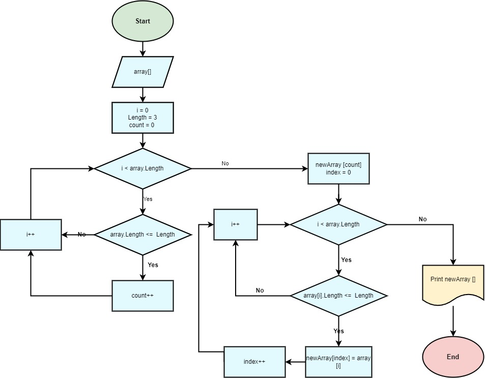

# _**Итоговая контрольная работа по основному блоку**_

**Задача:**<br/> 
```
Написать программу, которая из имеющегося массива строк формирует новый массив из строк, длина которых меньше, либо равна 3 символам. Первоначальный массив можно ввести с клавиатуры, либо задать на старте выполнения алгоритма. При решении не рекомендуется пользоваться коллекциями, лучше обойтись исключительно массивами.
```

**Примеры:**<br/> 
[“Hello”, “2”, “world”, “:-)”] → [“2”, “:-)”]<br/>
[“1234”, “1567”, “-2”, “computer science”] → [“-2”]<br/>
[“Russia”, “Denmark”, “Kazan”] → []<br/>

## Создать репозиторий на GitHub.

https://github.com/AndyPavlov94/ControlWork.git

## Нарисовать блок-схему алгоритма\



## Снабдить репозиторий оформленным текстовым описанием решения

Для решения задачи, необходимо написать метод, который принимает на вход исходный массив строк и возвращает новый массив, содержащий только те элементы, длина которых не превышает 3 символов.

В решении мы создаем метод FilterArray, который принимает исходный массив строк array. Первым делом мы проходим по исходному массиву и подсчитываем количество строк, длина которых не превышает 3 символов. Затем мы создаем новый массив строк result размером, соответствующим количеству строк, прошедших проверку.

Далее мы проходим по исходному массиву второй раз и добавляем в новый массив все строки, длина которых не превышает 3 символов. Для этого используется переменная index, которая указывает на текущую позицию в новом массиве.

После того, как все необходимые строки были добавлены в новый массив, мы возвращаем его в качестве результата работы метода.

Для вывода массивов на консоль используется метод PrintArray, который принимает на вход массив строк и выводит его элементы в квадратных скобках через запятую.

## Написать программу, решающую поставленную задачу

Код находится в папке "ControlWork"

## Использовать контроль версий в работе над этим небольшим проектом

Выполнил это условие 
